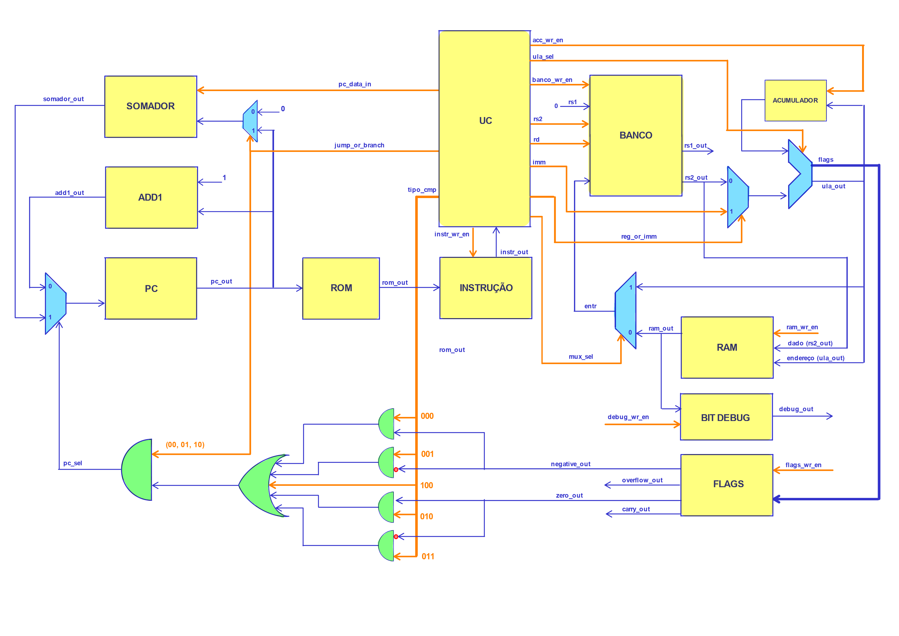

# Arquitetura e Organização de Computadores - UTFPR


## 📘 Descrição do Projeto
Este projeto foi desenvolvido como parte da disciplina de Arquitetura de Computadores, com o objetivo de aprofundar o entendimento sobre a construção e funcionamento de um processador. As entregas do projeto foram divididas em seis partes, cada uma focando em componentes específicos do processador, permitindo uma construção modular e detalhada.

1. Unidade Lógica e Aritmética (ULA), Banco de Registradores e Acumulador: A primeira entrega concentrou-se na ULA, responsável pelas operações matemáticas e lógicas, no Banco de Registradores, que armazena dados temporários, e no Acumulador, que guarda o resultado das operações da ULA.
2. Unidade de Controle (UC): A segunda etapa focou na UC, que coordena todas as operações do processador, enviando sinais de controle apropriados para os outros componentes, garantindo a correta execução das instruções.
3. Contador de Programa (PC) e Memória de Somente Leitura (ROM): A terceira parte do projeto envolveu o PC, que mantém o endereço da próxima instrução a ser executada, e a ROM, que armazena as instruções do programa a serem executadas.
4. Instruções: A quarta entrega tratou da Unidade de Instrução, responsável por receber as instruções da ROM e decodificá-las, determinando quais operações devem ser realizadas pelo processador.
5. ADD1 e Somador: Na quinta etapa, foram implementados o ADD1, um componente auxiliar que incrementa valores, e o Somador, que é fundamental para operações aritméticas e para a atualização do PC durante saltos ou ramificações.
6. Memória de Acesso Aleatório (RAM): A sexta e última entrega focou na RAM, que fornece armazenamento temporário para dados durante o processamento, permitindo leitura e escrita rápida de dados conforme necessário pelas instruções do programa.

## 📒 Descrição do Circuito



A imagem apresentada ilustra a organização e a interação entre os principais componentes do processador:

* Unidade de Controle (UC): Coordena as operações enviando sinais de controle.
* Banco de Registradores: Armazena dados temporários para acesso rápido.
* Unidade de Instrução: Decodifica as instruções da ROM.
* ROM e RAM: Armazenam instruções e dados temporários, respectivamente.
* Contador de Programa (PC): Mantém o endereço da próxima instrução.
* ULA: Realiza operações matemáticas e lógicas.
* Multiplexadores e Decodificadores: Direcionam o fluxo de dados e controlam operações.
* Flags: Armazena estados das operações da ULA.
* Bit Debug: Facilita a depuração do processador.

Este diagrama representa uma visão completa da arquitetura interna do processador, demonstrando como os componentes individuais trabalham em conjunto para executar instruções e processar dados eficientemente.

## ⚙ Como configurar

### GHDL
Baixar   o  ghdl-MINGW32.zip  da   versão   3.0   em: https://github.com/ghdl/ghdl/releases/tag/v3.0.0

### GTKWAVE
Baixar o `gtkwave-3.3.100-bin-win32` ou então o `gtkwave-3.3.100-bin-win64` que estão em: https://sourceforge.net/projects/gtkwave/files/.

### PATH do Windows para GHDL e GTKWave
Siga os passos ou procure instruções na internet:

1. Vá no Painel de Controle e na barra de busca, digite variáveis.
2. Clique em Editar as variáveis de ambiente; se escolher para o sistema ele abre outra janela e será para todos os usuários do PC, senão é só pra você.
3. Encontre a variável Path (o painel superior é do usuário, o inferior é do sistema):
  - Se   a   variável  Path  não   estiver   listada,   clique   em  Novo...;  coloque  Path  como   nome   e coloque as pastas do ghdl.exe e gtkwave.exe, separadas por ;  
    **(por exemplo, C:\ARQ_COMP\GHDL\bin; C:\ARQ_COMP\GTKWAVE\bin)**.
  - Se a variável Path estiver listada, clique nela e em Editar. Inclua então duas novas linhas, uma para cada aplicativo  
    **(por exemplo, C:\ARQ_COMP\GHDL\bin; C:\ARQ_COMP\GTKWAVE\bin)**.
4. Para testar, abra um terminal (cmd, por ex.) e digite ghdl -v (que deve mostrar a versão do GHDL) e depois gtkwave (que deve abrir o aplicativo).

## 📎 Como executar

Primeiro entre na pasta em que seus arquivos `.vhd ` estão, e em seguida execute os seguintes comandos: 

```
ghdl  -a  nomeArquivo.vhd
ghdl  -e  nomeArquivo

ghdl  -a  nomeArquivo_tb.vhd
ghdl  -e  nomeArquivo_tb
ghdl  -r  nomeArquivo_tb  --wave=nomeArquivo_tb.ghw

gtkwave nomeArquivo_tb.ghw
```